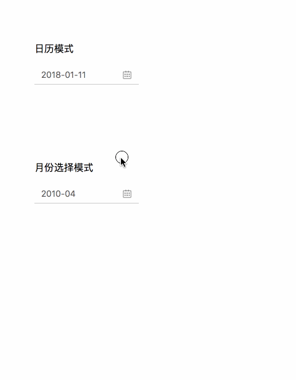

## datepicker

之前版本，可查看`tag` v1.0.0

```shell
$ git clone https://github.com/Rynxiao/datepicker.git
$ git tag
$ git checkout v1.0.0
```
## 重构之后版本 

`tag` v2.0.0（目前在master上开发，待基本功能完善推到此TAG）

### UI

参照 `Ant Design`，功能有所缩减

### 效果图



### 支持功能

- [] line模式
- [] 禁止选择模式
- [] 设置禁用起始日期以及结束日期
- [] 基本选择日期功能
- [x] 年模式
- [x] 月模式
- [x] 中国农历月份

### 待完善

- [x] 案例制作
- [x] 使用文档完善

### node及npm版本

```shell
$ node -v 
v8.11.3

$ npm -v
v5.6.0

$ yarn -v
1.7.0
```

### react版本

```shell
react v16.5.2
```

### 开发模式

```shell
yarn install
yarn start:dev
```

### 生产模式

```shell
yarn build
```


