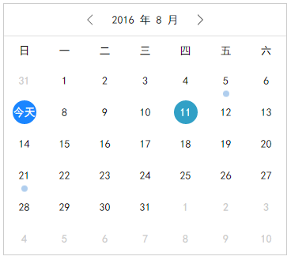
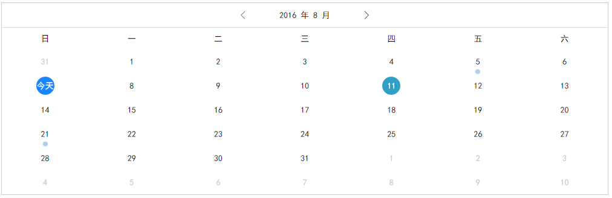

# datepicker
日历组件

---------------------
**个人娱乐所写,分为普通js方式以及react组件形式**

支持功能：

1. 初始化日期
2. 高亮'今天'以及选择日期
3. 历史记录选择日期
4. 支持tag标识
5. 支持选择日期回调
6. 支持上一月/下一月选择回调
7. 支持tags动态切换
8. 屏幕适应

---------------------

## 安装方式
```javascript
npm install
npm run start
```

## react 调用方式

```javascript
import React from 'react';
import ReactDOM from 'react-dom';
import Calendar from './Calendar';

const App = React.createClass({

    /**
     * 初始状态
     * @returns {{tags: number[]}}
     */
    getInitialState() {
        return {
            tags : [5, 21]
        }
    },

    /**
     * 选择日期
     * @param year
     * @param month
     * @param day
     */
    selectDate(year, month, day) {
        console.log("选择时间为：" + year + '年' + month + '月' + day + '日' );
    },

    /**
     * 上一个月
     * @param year
     * @param month
     */
    previousMonth(year, month) {
        console.log("当前日期为：" + year + '年' + month + '月');
        this.setState({tags : [7, 11]});
    },

    /**
     * 下一个月
     * @param year
     * @param month
     */
    nextMonth(year, month) {
        console.log("当前日期为：" + year + '年' + month + '月');
        this.setState({tags : [8, 23]});
    },

    /**
     * 组件渲染
     * @returns {XML}
     */
    render() {
        return (
            <Calendar
                onSelectDate={this.selectDate}
                onPreviousMonth={this.previousMonth}
                onNextMonth={this.nextMonth}
                year="2016"
                month="8"
                day="7"
                tags={this.state.tags} />
        );
    }
});

export default App;
```

## 效果

手机效果



其他效果


